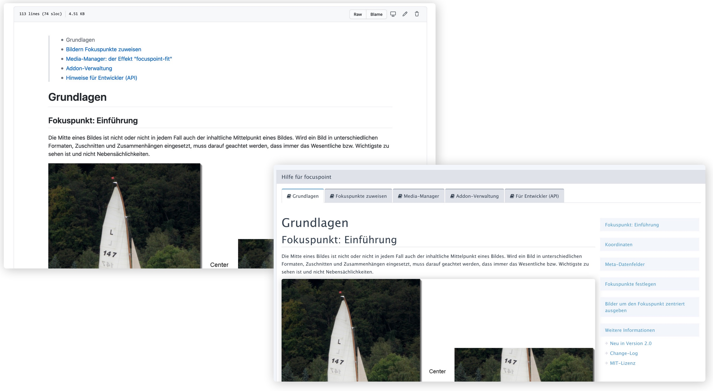

# **HELP.PHP** für REDAXO ab V5.7

Mit **HELP.PHP** können komplexe Handbücher bzw. Online-Dokumentation für [REDAXO](https://redaxo.org/)-Addons
bereitgestellt werden:

- Dual-Use-Dokumentation &ndash; nutzbar auf Github und im REDAXO-Backend
- Ersatz für das Plugin "documentation" (aka "Doku-Plugin")
- Aufruf aus der Addon-Verwaltung (Button "Hilfe") an Stelle der `README.md`
- Als Seite im Addon konfigurierbar

Alle Informationen zu
- Installation
- Konfiguration
- Nutzung

sind im [Handbuch](docs/manual.md) beschrieben.

## Credits

Enthält JS und CSS für Syntax-Highlighting mit
- [PrismJS](https://prismjs.com/) und
- [ClipboardJS](https://clipboardjs.com/)

## Lizenz

MIT-Lizenz
