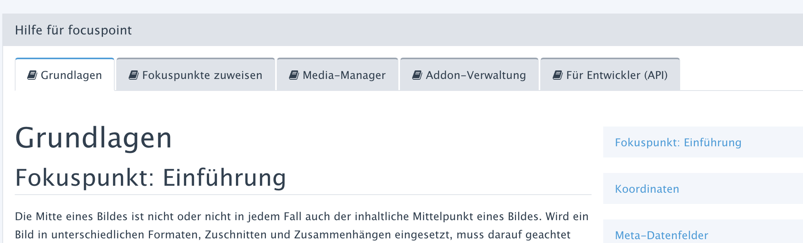

# **HELP.PHP** für REDAXO ab V5.7

Mit **HELP.PHP** können komplexe Handbücher bzw. Online-Dokumentation für [REDAXO](https://redaxo.org/)-Addons
bereitgestellt werden:

- Dual-Use-Dokumentation &ndash; nutzbar auf Github und im REDAXO-Backend
- Ersatz für das Plugin "documentation" (aka "Doku-Plugin")
- Aufruf aus der Addon-Verwaltung (Button "Hilfe") an Stelle der `README.md`
- Als Seite im Addon konfigurierbar

> - [Installation](#i)
> - [Dual-Use &ndash; Github vs. REDAXO](#a)
>   - [Github first](#a1)
>   - [Links und Link-Transformation](a2)
>   - [Hauptnavigation](#a3)
> - [Konfiguration per 'package.yml'](#b)
>   - [Sektion "help:"](#b1)
>   - [Handbuch-Seiten (page=...)](#b2)
>   - [Fallback](#b3)
> - [Assets](#c)
> - [Absicherung](#d)
> - [Sprachunterstützung](#e)
> - [Individualisierung (CSS, JS)](#f)
> - [Extension-Points](#g)
>   - [Integration](#g1)
>   - [EP HELP_NAVIGATION](#g2)
>   - [EP HELP_HREF](#g3)

<a name="i"></a>
## Installation

Die Datei **HELP.PHP** ist eine der optionalen Dateien in der
[Struktur eines Addons](https://redaxo.org/doku/master/addon-struktur). Sie wird im
Root-Verzeichnis des Addons erwartet.

Die Konfiguration erfolgt über die gleichfalls im Addon-Root liegende Konfigurationsdatei
[_package.yml_](https://redaxo.org/doku/master/addon-package).
Fehlt die individuelle Konfiguration, wird **HELP.PHP** die README-Datei des Addons anzeigen.

Die Installation umfasst somit drei Schritte:
- **HELP.PHP** aus diesem Repository in das Root-Verzeichnis des Addons kopieren,
- in der _package.yml_ die erforderliche Konfiguration vornehmen und
- im doc-Verzeichnis des Addons die Texte (Markdown) und ggf. Assets (z.B. Bilder) bereitstellen

Optional kann [CSS und JS](#f) bereitgestellt werden:
- aus dem Repository _help.min.css_ und _help.min.js_ u. a. für Syntax-Highligthing und bessere optische
  und funktionale Integration in REDAXO
- selbst erstelltes CSS/JS als _help.min.css_ und _help.min.js_

<a name="a"></a>
## Dual-Use &ndash; Github vs. REDAXO

Eine Zielsetzung besteht darin, die einzelnen Dateien des Online-Handbuchs sowohl auf Github
als auch im REDAXO-Backend vergleichbar nutzen zu können, ohne zwei Dokumentationen pflegen zu müssen.
Das wird evtl. nicht in allen Einzelpunkten immer funktionieren, aber weitgehend ist es möglich.

Die Dateien müssen so aufbereitet sein, dass sie zunächst auf Github korrekt angezeigt
werden. Für das REDAXO-Backend werden die Links durch **HELP.PHP** so verändert, dass sie einen
korrekten Aufruf der Backend-Seite ergeben.

<a name="a1"></a>
### Github first

**Github first** bedeutet, dass die Texte zuerst auf Github funktionieren sollten. Dabei darf man den
Blick auf die spätere Nutzung in REDAXO nicht vergessen und die nachstehenden Regeln nicht außer
acht lassen.

Nicht alle Verlinkungen sind tatsächlich 1:1 transformierbar. Man muss Kompromisse zulassen.

<a name="a2"></a>
### Links und Link-Transformation

Links zwischen den Dokumenten im Addon und zu weiteren im Addon-Verzeichnis liegenden Ressourcen bzw.
Assets sollten immer relativ sein (readme.md: -> docs/xyz.md, docs/xyz.md: ->../readme.md).

**HELP.PHP** baut diese Links so um, dass sie durch eine geeignete Backend-URL ersetzt werden. Es werden
nur Markdown-Links zu Dokumenten (`[label](link)`) bzw. Bildern (``) umgebaut,
keine HTML-Tags (A, IMG). Daher sollten A- und IMG-Tags für relative Links innerhalb des Addons
vermieden werden. Sie sind problemlos nutzbar, wenn eine absolute URL (`https://...`) angegeben wird.

Links wie `?page=mediapool/media`, mit denen aus der Dokumentation direkt auf Seiten innerhalb der
REDAXO-Instanz verwiesen wird, funktionieren im REDAXO-Backend, aber nicht auf der Github-Seite.

Links aus dem Addon heraus in andere Addons sind nicht zulässig, weil sie auf Github i.d.R. nicht
funktionieren und in REDAXO aus [Sicherheitsgründen](#d) geblockt sind.

Die Ersetzungsregel für Links ist:
- Links der Art `http://...` werden nicht ersetzt
- Mit `?` beginnende Links werden nicht ersetzt.
- Mit `#` beginnende Links werden nicht ersetzt.
- Alle anderen Links werden als Parameter an die aktuelle Seiten-URL angehängt. Der Parameter
  `&doc=«link»` wird stets relativ zum Root-Verzeichnis des Addons angegeben.
- Innerhalb von Codeblöcken (\`\`\` ... \`\`\` bzw. \`...\`) findet keine Ersetzung statt.

Z.B. wird beim Aufruf aus der Addon-Verwaltung aus dem initialen Aufruf
```html
index.php?page=packages&subpage=help&package=addon_name
```
die Link-URL
```html
index.php?page=packages&subpage=help&package=addon_name&doc=docs/originallink
```

<a name="a3"></a>
### Hauptnavigation

Über dem jeweils angezeigten Text kann eine Hauptnavigation (Tab-Menü) eingebaut werden. Das Menü dient
dem schnellen Wechsel zwischen Hauptkapiteln eines komplexen, mehrseitigen Online-Handbuchs.    

Auf der Github-Seite kann ersatzweise am Anfang der Datei eine Link-Liste in einem Quote-Tag platziert
werden. Die Links verweisen auf die anderen Dateien der Hauptnavigation. Diese Zeilen werden von
**HELP.PHP** im REDAXO-Backend wieder entfernt und durch die Hauptnavigation ersetzt, die in der
_package.yml_ konfiguriert wird.

> Der Vorteil der unabhängigen Backend-Navigation: sie ist auch verfügbar, wenn auf einen Text ohne
> Navigation verlinkt wird.

Aus der Github-Version

```markdown
> - Grundlagen
> - [Bildern Fokuspunkte zuweisen](edit.md)
> - [Media-Manager: der Effekt "focuspoint-fit"](media_manager.md)
> - [Addon-Verwaltung](install.md)
> - [Hinweise für Entwickler (API)](developer.md)

# Grundlagen
...
```
 wird die Backend-Darstellung



<a name="b"></a>
## Konfiguration per _package.yml_

<a name="b1"></a>
### Sektion "help:"

In der _package.yml_ erfolgt die Konfiguration über eine eigene Sektion `help:`. Neben einer
Default-Konfiguration können auch gezielt spezielle Layouts für ausgewählte Backend-Seiten hinterlegt
werden. Dies ist die Grundstruktur:

```yaml
...
help:
    default:
        ...default-Konfiguration...
    addon/page/subpage:
        ...Konfiguration für die angegebene page
...
```

Innerhalb einer Konfigurationsgruppe wird hauptsächlich die Navigation definiert. Die Namen der
einzelnen Einträge sind aus YAML-Sicht notwendig, spielen aber technisch keine Rolle.
Nummern bieten sich an:
```yaml
help:
    default:
        initial: docs/overview.md
        0:
            title: translate:focuspoint_docs_overview
            icon: fa fa-book
            path: docs/overview.md
        1:
            title: translate:focuspoint_docs_edit
            icon: fa fa-book
            path: docs/edit.md
```

Die mit `initial: ...` angegebene Datei wird beim ersten Aufruf angezeigt. Falls der Eintrag
`initial: ...`fehlt, wird der erste gefundene Eintrag mit `active: true` herangezogen bzw. der
erste Eintrag der Navigation.

Zulässige Schlüsselwörter für einen Eintrag in der Hauptnavigation sind:

| Schlüsselwort | |Beschreibung | Beispiel |
|---|---|---|---|
| title | | analog zu page-Einträgen der Titel des Eintrags, z.B. als Text oder mit i18n-Übersetzung | translate:xxx |
| path | path _oder_ href | Das anzuzeigende Dokument. Der Pfad muss relativ zum Addon-Root angegeben werden | docs/page.md |
| href | path _oder_ href | Eine URL statt «path»; «path» hat Vorrang vor «href» | ?page=.... |
| active | optional | Dieser Eintrag wird initial aktiviert | true |
| icon | optional | Die CSS-Klassen für ein &lt;i&gt;-Tag-Icon analog zu page-Einträgen | fa fa-book

Falls das Menü nur einen Eintrag hat, wird es nicht angezeigt.

<a name="2"></a>
### Handbuch-Seiten (page=...)

Die **HELP.PHP** kann auch für Seiten genutzt werden, die per package.yml definiert werden.

**Beipiel: eine Handbuch-Seite im Addon**

```yml
page:
    title: translate:geolocation_title
    icon: rex-icon fa-globe
    subpages:
        ...
        docs:
            title: translate:geolocation_manpage
            icon: fa fa-book
            subPath: help.php
```

Auf dieser Basis sucht **HELP.PHP** zunächst nach der Sektion `help:` und dort nach einer Untergruppe
`addon_name/docs:` bzw. als Fallback nach `default:`.

<a name="b3"></a>
### Fallback

Sofern **HELP.PHP** keine anderen Informationen aus der _package.yml_ vorliegen, wird immer die Datei
_README.md_ angezeigt.

<a name="c"></a>
## Assets

Neben Markdown-Dokumenten (.md) selbst können aus einem Dokument heraus auch andere Ressourcen, insbesondere
Bilder eingebunden werden. Sie müssen konform zu den [Absicherungsregeln](#d) im docs-Verzeichnis platziert werden.
Der Übersichtlichkeit förderlich ist ein separates Unterverzeichnis, z.B. `docs/assets`.

**HELP.PHP** schleust Dateien, die nicht vom Typ _Markdown_ sind, mit ihrem Mime-Type durch. Dateien,
deren Suffix nicht auf der Liste der für den Medienpool zulässigen Dokumenttypen stehen, werden geblockt.

Bilder, erkennbar am Mime-Typ `image/...`, werden direkt ausgegeben. Alle anderen Dateien werden
als Download geschickt.

<a name="d"></a>
## Absicherung

Die für den Abruf generierten URLs enthalten den Dokumentennamen der aufzurufenden Datei. Über eine
manipulierte URL ließen sich theoretisch Dateien abrufen, die sicherheitsrelevante oder vertrauliche
Informationen enthalten.
```html
index.pgp?page=addon/docs&doc=../../../data/core/config.yml
```

Um das zu verhindern, werden angegebene Zielnamen immer normiert (also ../ herausgerechnet) und dann
mit den Addon-Verzeichnis abgeglichen. Alle Dokumente, deren normierte Pfade außerhalb des
Addons liegen, werden als "nicht existent" betrachtet.

Auch innerhalb des Addons sind nur folgende Dateien zulässig:
- «addon_root»/README.md
- «addon_root»/LICENSE.md
- «addon_root»/CHANGELOG.md
- «addon_root»/CREDITS.md
- «addon_root»/docs/*

<a name="e"></a>
## Sprachunterstützung

In mehrsprachigen Dokumentationen - bisher eher selten im READXO-Kosmos - werden sprachspezifische
Varianten über einen Sprachcode vor dem Suffix markiert:

```
docs/overview.md
docs/overview.en.md
docs/overview.sv.md
docs/assets/input.jpg
docs/assets/input.en.jpg
docs/assets/input.sv.jpg
```

Im REDAXO-Backend wird jeweils die Datei ausgewählt, die der eingestellten Backend-Sprache entspricht.
Gibt es die Datei (z.B. _docs/overview.de.md_) nicht, wird als Fallback die Basisversion genommen
(z.B. _docs/overview.md_). Eine alternativ vorhandene Sprache (im Beispiel `.en.`) wird nicht gesucht.

Auf Github können sprachspezifische Dateien direkt untereinander verlinkt werden. Z.B wird aus
_docs/overview.en.md_ das Bild _docs/assets/input.en.jpg_ aufgerufen, allerdings gibt es hier kein Fallback. 

```markdown

```

In REDAXO-Backend wird der Dateiname zunächst um den Sprachcode erleichtert und dann die aktuelle
Sprache herangezogen. Am Beispiel der Backend-Sprache `de`:

| Aufruf | Bereinigt | Suche nach | Fallback |
|---|---|---|---|
| _overview.en.md_|_overview.md_|_overview.de.md_|_overview.md_|
| _assets/input.en.md_|_assets/input.md_|_assets/input.de.md_|_assets/input.md_|
| _overview.sv.md_|_overview.md_|_overview.de.md_|_overview.md_|
| _overview.md_|_overview.md_|_overview.de.md_|_overview.md_|

<a name="f"></a>
## Individualisierung (CSS, JS)

> Dieser Punkt hat nur Auswirkungen im READXO-Backend, nicht in der Github-Ansicht.

Die Markdown-Dateien werden über die Methode `rex_markdown::parseWithToc()` und das Fragment
`core/page/docs.php` aufbereitet. Für die Anzeige wird das dafür in REDAXO vorgesehene CSS verwendet.

Sofern eine darüber hinaus gehende Individualisierung gewünscht ist, z.B. für Syntax-Highlighting
oder ein anderes Layout, können im Asset-Verzeichnis des Addons CSS- und JS-Dateien bereitgestellt werden.
**HELP.PHP** versucht stets, diese Dateien (_help.min.css_ bzw. _help.min.js_) vor der Ausgabe einer
Markdown-Datei zu laden.

Im Repository sind bereits zwei vorgefertigte Dateien:

- _**help.min.css**_  
  Die Datei enthält die CSS-Tags von [PrismJS](https://prismjs.com/) für Syntax-Highlighting sowie
  einige kleine Anpassungen im REDAXO-CSS (z.B. Textspalte auf 950px begrenzt, breitere Sprungnavigation).
- _**help.min.js**_  
  Die Datei enthält JS-Code von [PrismJS](https://prismjs.com/) für Syntax-Highlighting,
  [ClipboardJS](https://clipboardjs.com/) um den Code-Block in das Clipboard zu kopieren sowie
  einige kleine Anpassungen im REDAXO-Context (PrismJS-Initialisierung auch bei `rex:ready`).

Das Syntax-Highligthing unterstützt
- Template / Theme
    - Tomorrow Night
- Sprachen
    - javascript
    - html
    - css
    - php
    - sql
    - yaml
    - json
    - less
    - markdown
    - regex
- Plugins
    - Toolbar (notwendig für die beiden folgenden Toolbar-Plugins)
    - Show Language
    - Copy to Clipboard Button (benötigt [clipboard](https://clipboardjs.com/))

<a name="g"></a>
## Extension-Points

<a name="g1"></a>
### Integration

Damit die EPs nicht bei jedem Seitenaufruf aktiviert werden, sollten sie nur dann belegt werden, wenn
tatsächlich eine Hilfe-Seite aufgerufen wird. Dazu bietet sich an
- Aktivierung der EPs an den Anfang der _help.php_ schreiben statt in eine _boot.php_.
  Dann muss bei evtl neuen Versionen von **HELP.PHP** daran gedacht werden, die Änderung zu Übernehmen.
- Verwendung einer eigenen **help.php**, die die eigentliche **HELP.PHP** einbindet.

Hier ein Beispiel für eine eigene _help.php_:
```php
<?php
\rex_extension::register( 'HELP_NAVIGATION', function( \rex_extension_point $ep ){
    ...
});
\rex_extension::register( 'HELP_HREF', function( \rex_extension_point $ep ){
    ...
});
include 'pfad_zur_original_/help.php';
```

<a name="g2"></a>
### EP HELP_HREF

Jeder im Text gefundene Link kann vor der Ersetzung im Text noch bearbeitet werden. Der EP wird je
Link aufgerufen und erhält über `$ep->getParams()` die Bestandteile, aus denen der Link ursprünglich
und nach der Transformation besteht. `$ep->getSubject()` enthält den neuen Link nach Transformation.

Hier ein Beispiel:

```php
array:1 [▼
    "ep" => rex_extension_point {#42 ▼
        -name: "HELP_HREF"
        -subject: "[Allgmeine Übersicht (README)](index.php?page=geolocation/docs&doc=docs/../README.md)"
        -params: array:6 [▼
            "source" => "[Allgmeine Übersicht (README)](../README.md)"
            "label" => "Allgmeine Übersicht (README)"
            "link" => "../README.md"
            "href" => "index.php?page=geolocation/docs&doc=docs/../README.md"
            "isImageLink" => false
            "context" => rex_addon {#24 ▶}
        ]
        -extensionParams: []
        -readonly: false
    }
]
```

<a name="g3"></a>
### EP HELP_NAVIGATION

Bevor die Navigation in HTML gegossen wird, kann das Navigationsmenü noch via Extension-Point
bearbeitet werden. Das Menü selbst wird mit dem Fragment `core/navigations/content.php` erstellt.
Das Array, dass die Konfigurationsinformationen je Menüpunkt enthält, ist im EP mit
`$ep->getSubject()` zugänglich.

Das Originalprofil aus der package.yml des Addons wird in `$ep->getParams()` übergeben.

Hier ein Beispiel:

```php
array:1 [▼
    "ep" => rex_extension_point {#42 ▼
        -name: "HELP_NAVIGATION"
        -subject: array:5 [▼
            0 => array:8 [▼
                "linkClasses" => []
                "itemClasses" => []
                "linkAttr" => []
                "itemAttr" => []
                "href" => "index.php?page=geolocation/docs&doc=docs/overview.md"
                "title" => "Übersicht"
                "active" => true
                "icon" => "fa fa-book"
            ]
            1 => array:8 [▶]
            2 => array:8 [▶]
            3 => array:8 [▶]
            4 => array:8 [▶]
        ]
        -params: array:2 [▼
            "profile" => array:5 [▼
                0 => array:3 [▼
                    "title" => "Übersicht"
                    "icon" => "fa fa-book"
                    "path" => "docs/overview.md"
                ]
                1 => array:3 [▶]
                2 => array:3 [▶]
                3 => array:3 [▶]
                4 => array:3 [▶]
            ]
            "context" => rex_addon {#24 ▶}
        ]
        -extensionParams: []
        -readonly: false
    }
]
```
